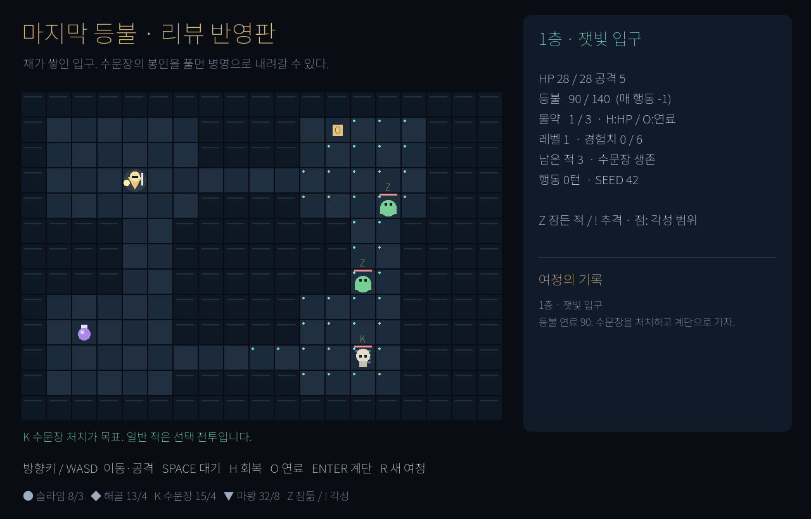

# 마지막 등불 · 리뷰 반영판

[원본 게임](../last-lantern/README.md)의 기존 리뷰 6개·종합을 읽고 만든 두 번째
Godot 게임입니다. [GDD v2.0](./gdd.txt)를 먼저 작성했으며 생성 모델
**gpt-6.1-sol**, reasoning effort **high**를 기록했습니다.

[두 게임 비교 데모](../../docs/demo/index.html)에서 **리뷰 지적 → 원본 → 반영 결과**를
한눈에 보고 실제 두 Godot 웹 게임을 불러올 수 있습니다. 로컬 서버 실행 방법은
[정적 데모 안내](../../docs/README.md)에 있습니다.



## 무엇이 달라졌나

| 원본 규칙 | 리뷰 반영 규칙 |
| --- | --- |
| 대기가 무료, 등불은 장식 | 매 행동 연료 −1, 소진하면 패배 |
| 물약은 HP 회복에만 사용 | H: HP +10 / O: 연료 +20 중 선택 |
| 전멸해야 다음 층 | 수문장만 처치하면 개방, 추가 전투 선택 |
| 마왕 뒤에도 남은 적을 처치 | 마왕 처치 즉시 승리 |
| 마왕도 추격·근접 공격 | 왕좌 고정, 불길 예고 → 공격 → 회복 |
| 각성 미표시·벽을 무시하는 거리 | Z/!, 각성 범위 점, 벽을 따른 거리 |
| 상한이면 아이템이 바닥에 남음 | 밟으면 소비, 넘치는 용량은 버림 |
| 시스템 한글 폰트 필요 | OFL Noto Sans KR 동봉 |

[지적 30개·쟁점 6개의 반영 내역](./review-response.md)에 결정과 검증을 연결했습니다.
기존 리뷰·게임 소스는 변경하지 않았습니다. 원본 구현에도 있던 결말·3층 계단
없음·확인창 차단은 새 기능으로 표시하지 않습니다. 기존 GDD에서 빠진 명세를
개정 GDD에 확정한 항목과 실제 규칙 변경을 구분했습니다.

## 실행

1. Godot **4.7.2**의 프로젝트 매니저에서 [godot/project.godot](./godot/project.godot)을 가져옵니다.
2. 열고 **F5**, 시작 화면에서 Enter 또는 시작 버튼을 누릅니다.
3. `godot/` 폴더 전체를 옮겨도 실행됩니다. 별도 하네스·플러그인이 필요하지 않습니다.

| 키 | 행동 |
| --- | --- |
| 방향키 / WASD | 한 칸 이동 / 적에게 근접 공격 |
| Space | 한 턴 대기. 연료 1 소비 |
| H | 물약 1개로 HP 최대 10 회복 |
| O | 같은 물약 1개로 연료 최대 20 보충 |
| Enter | 시작 / 열린 계단 위에서 내려가기 |
| R | 새 seed의 여정. 플레이 중에는 확인창 |

1·2층에서는 **K 수문장**이 계단을 엽니다. 일반 적을 남겨 두고 내려가거나,
연료·HP를 써서 경험치를 얻을 수 있습니다. 3층 마왕은 움직이지 않습니다.
**X**가 보이면 다음 행동에서 그 칸을 벗어나세요. 불길 뒤 회복 턴에는 공격할
기회가 있습니다. 마왕을 쓰러뜨리면 남은 해골과 관계없이 승리합니다.

시작·결과 화면의 seed 입력으로 같은 판에 재도전할 수 있습니다. 최소 승리
턴 기록은 현재 세션에만 남고 종료 시 사라집니다. 영구 성장은 없습니다.

## 검증

[VALIDATION.md](./VALIDATION.md)에 실제 Godot·브라우저 결과를 기록했습니다.
게임 내부의 검증 모드도 제공합니다. 이는 일반 플레이에 필요하지 않습니다.

```powershell
& 'C:\Program Files\Godot\Godot_v4.7.2-stable_win64_console.exe' --headless --path './examples/last-lantern-reviewed/godot' -- --check-seeds=100
```

자동 정책의 승률은 사람의 첫 판 승률이 아닙니다. 외부 초보자의 이해도,
5~10분 체험 시간, 재미 목표는 아직 미검증입니다. 새 독립 리뷰를 통과했다고
주장하지 않습니다.

## 코드 읽기

- [main.gd](./godot/main.gd): 생성, 자원, 전투, 입력, 결과, 화면과 웹 비교 상태 표시
- [self_check.gd](./godot/self_check.gd): 게임 메서드를 실행하는 내장 자가 점검과 두 정책
- [리뷰 반영표](./review-response.json): 지적 ID별 원본·변경·구현·검증 대응
- [웹 내보내기](../../tools/export-demos.ps1): 원본 빌드 사본과 개선본을 각각 내보내기

예제 작성·유지관리: Sungkuk Park(박성국). 자작 예제이며 기존 게임의 소재를
복제하지 않았습니다. 저장소 전체에 대한 추가 이용 조건은 [권리 안내](../../RIGHTS.md)를
따릅니다. 동봉 글꼴은 [SIL OFL 1.1](./godot/assets/OFL.txt)이며
[Google Fonts의 Noto Sans KR](https://github.com/google/fonts/tree/main/ofl/notosanskr)에서 가져왔습니다.
