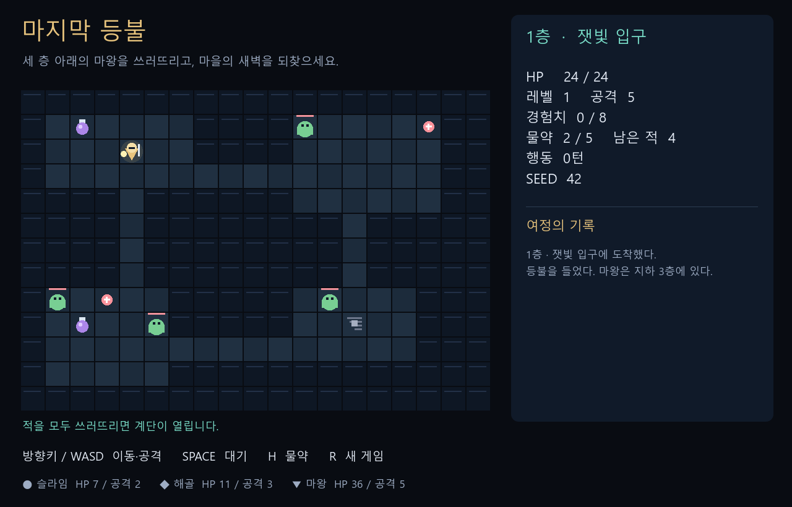
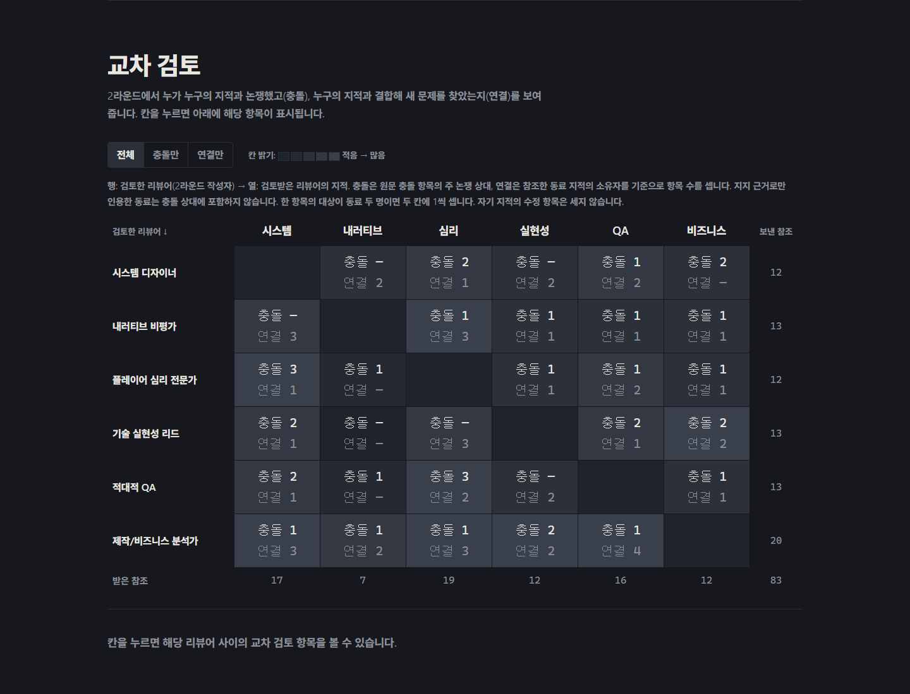

# 마지막 등불

마을의 마지막 등불을 든 용사가 3층 지하 요새에서 마왕을 쓰러뜨리는 작은
턴제 로그라이크입니다. [GDD](./gdd.txt)를 먼저 작성하고 리뷰 없이 구현했습니다.
GDD에 생성 모델 **gpt-6.1-sol**, reasoning effort **high**를 명시했습니다.

이 게임과 기존 리뷰는 비교 기준으로 보존했습니다. 해당 리뷰를 반영한
[두 번째 게임](../last-lantern-reviewed/README.md)과
[원본·개선본 비교 데모](../../docs/demo/index.html)에서 바뀐 규칙을 확인하세요.



## 실행

1. **Godot Engine 4.7.2**를 실행합니다.
2. 프로젝트 매니저에서 **가져오기(Import)**를 눌러
   [godot/project.godot](./godot/project.godot)을 선택합니다.
3. 프로젝트를 열고 **F5**를 누릅니다. 시작 화면에서 Enter 또는 **여정 시작**을
   누르면 게임이 시작됩니다.

`godot/` 폴더 전체를 다른 위치로 복사해도 실행됩니다. 외부 에셋, 플러그인,
별도 하네스, 내보내기 템플릿 설치가 필요하지 않습니다. `.godot/`는 첫 실행 시
Godot가 생성하는 캐시이므로 전달할 때 제외해도 됩니다.

현재 Windows 환경에서는 PowerShell로도 바로 실행할 수 있습니다.

```powershell
& 'C:\Program Files\Godot\Godot_v4.7.2-stable_win64.exe' --path 'D:\wkspaces\gamedesign\gdd-review-kit-ko\examples\last-lantern\godot'
```

같은 초기 던전을 재현하려면 명령 끝에 `-- --seed=42`를 붙이세요. seed는
HUD에도 표시됩니다. 재시작은 새 seed를 사용합니다.
[Godot 공식 명령행 안내](https://docs.godotengine.org/en/stable/tutorials/editor/command_line_tutorial.html)를
참고할 수 있습니다.

## 조작

| 키 | 행동 |
| --- | --- |
| 방향키 / WASD | 한 칸 이동. 적이 있으면 근접 공격 |
| Space | 한 턴 대기 |
| H | 물약 사용: HP 최대 12 회복 |
| Enter | 시작 화면에서 게임 시작 |
| R | 새 게임. 플레이 중에는 확인창 표시 |

키를 길게 누르는 반복 입력은 처리하지 않습니다. 벽에 부딪히거나 사용할 수
없는 물약을 시도하면 턴이 지나가지 않습니다. 이동·공격·회복·대기를 하면 적도
한 번씩 행동합니다. 적의 범위에 여러 마리가 들어오면 한 턴에 여러 번 맞습니다.

## 한 판의 흐름

탐험 → 전투 → 경험치·아이템 획득 → 레벨업 → 다음 층 → 마왕전 → 승리 또는
사망 → 새 여정.

1·2층에서는 모든 적을 처치한 뒤 청록색 계단으로 이동하세요. 3층에서는 마왕과
남은 적을 모두 처치하면 승리합니다. 적이 다가오면 길목에서 한 마리씩 상대하고,
HP가 낮아지기 전에 물약을 사용하세요. 보라색 병은 물약, 붉은 구슬은 즉시 회복입니다.

레벨업하면 최대 HP와 공격력이 오르고 HP가 일부 회복됩니다. 층 이동 시에도
HP가 일부 회복됩니다. 죽으면 성장과 물약은 초기화됩니다.

## 파일과 범위

- `gdd.txt`: 구현 전 디자인과 생성 모델·effort 정보
- `godot/project.godot`: Godot가 가져올 프로젝트 파일
- `godot/main.tscn`: 기본 시작 장면
- `godot/main.gd`: 게임 규칙, 입력, UI, 도형 렌더링
- `godot/icon.svg`: 직접 작성한 프로젝트 아이콘
- [VALIDATION.md](./VALIDATION.md): 실제 엔진 실행 검증 결과
- [run-log.md](./run-log.md): Claude Code 리뷰와 브라우저 실행 기록
- [검토 보드](./review-board.html), [종합 보고서](./reviews/SYNTHESIS.md): 실제 GDD 리뷰 결과
- [인터랙티브 시각화](./review-viz.html): 이슈·쟁점·교차 검토·심각도와 지적 필터
- [최종 시각화 감사](./reviews/viz-audit.md): 필수 수정 0건, 남은 권고와 검증 한계

GDD와 게임을 먼저 완성한 뒤 별도 Claude Code 세션으로 리뷰를 진행했습니다.
다섯 라운드와 두 HTML의 Edge·Firefox 검증을 완료했습니다. HTML은 내려받아
브라우저에서 열면 됩니다. 리뷰는 구현 전 GDD만을 입력으로 사용했으며,
실제 게임의 실행 여부는 평가하지 않았습니다.

[](./review-viz.html)

Godot 기본 도형과 시스템 글꼴을 사용합니다. 한국어를 표시하려면 운영체제에
맑은 고딕, Noto Sans CJK KR, Noto Sans KR 또는 Apple SD Gothic Neo 등 한글
글꼴이 있어야 합니다. Windows의 맑은 고딕으로 화면을 확인했습니다.

저장·불러오기, 영구 성장, 오디오, 운영체제별 실행 파일 내보내기는 구현 범위에
포함하지 않습니다. Godot 프로젝트 자체를 열어 플레이하는 예제입니다.
